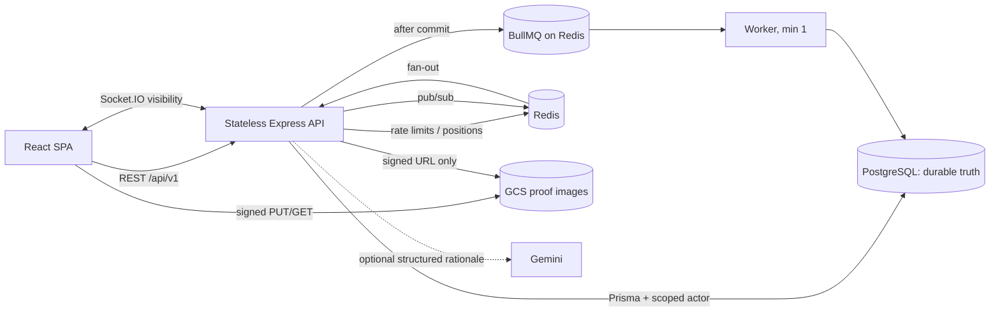
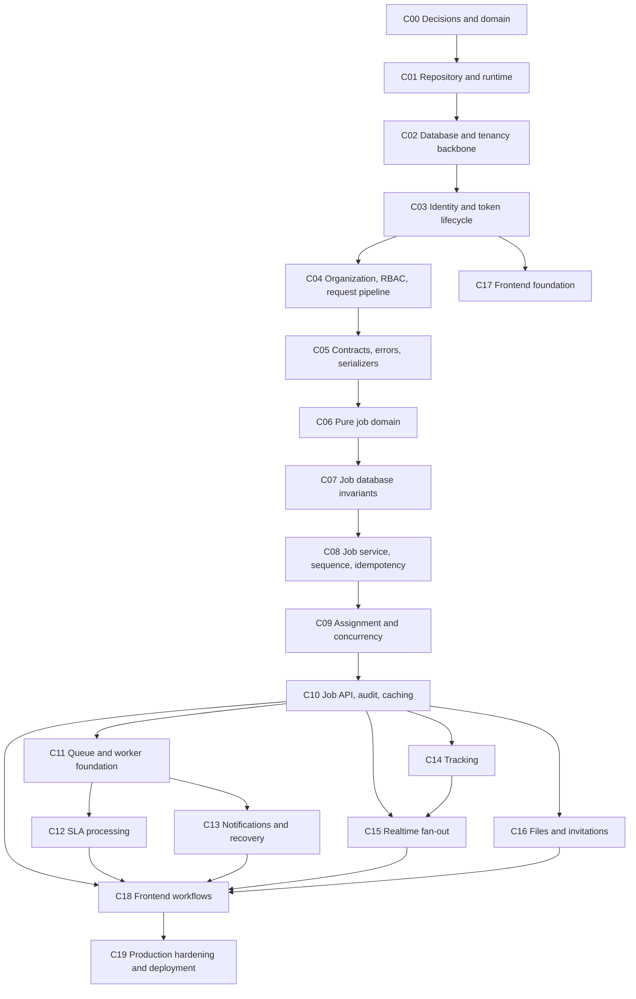

# DispatchGrid — Component and Dependency Build Guide

> Primary development guide derived from `Dispatch.md` (DispatchGrid Master Project Plan, v1.0). This guide changes the **order of explanation and construction**, not the architecture. It replaces the source document's day/phase schedule with a dependency-driven component plan.

## 0. How to use this guide

Read Sections 0–5 once before coding. Then build Components C00–C19 in order. Every component contains:

- what the component adds to the growing system;
- its code and knowledge prerequisites;
- the exact LedgerLine files or patterns to reuse;
- small construction steps;
- invariants and failure behavior;
- tests and a definition of done;
- an explanation you should be able to give in an interview.

Use the checkboxes as gates. Do not start a component merely because a calendar says to. Start it when its dependency checks pass.

### 0.1 Provenance labels from `Dispatch.md`

These labels retain their original meaning throughout this guide:

| Label | Meaning | How to treat it while building |
|---|---|---|
| `[ESTABLISHED]` | Fixed product requirement, NFR, constraint, or scope boundary | Implement it; do not redesign it casually |
| `[DECIDED]` | Architectural decision already made and justified | Preserve it unless a serious contradiction is discovered |
| `[RECOMMENDATION]` | Proposed implementation direction, added where the design session had not settled detail | Follow by default; alternatives must be recorded explicitly |
| `[OPTIONAL]` | Deliberately deferred or excluded | Do not let it enter the required path |
| `[AMBIGUITY]` | The source deliberately leaves a question unresolved | Resolve at the named decision gate; do not invent silently |

### 0.2 Reuse labels

`Dispatch.md` calls LedgerLine the existing reusable architecture artifact. This guide uses the user's LedgerLine name consistently.

| Label | Meaning |
|---|---|
| `[REUSED]` | Copy the LedgerLine file or behavior unchanged. New uses of an existing error factory do not change the file |
| `[ADAPTED]` | Keep LedgerLine's structure or mechanism but deliberately change names, fields, dependencies, routes, or behavior |
| `[NEW]` | DispatchGrid-specific code written from scratch, sometimes following a LedgerLine pattern |

Before copying anything, compare the actual LedgerLine checkout with the paths below. `Dispatch.md` identifies several directories by responsibility rather than giving every leaf filename. Where this guide uses a glob such as `server/src/auth/*`, copy only the corresponding LedgerLine files and preserve their internal tests.

### 0.3 The non-negotiable system boundary

`[DECIDED]` DispatchGrid is deterministic production software, not an AI-agent system.

- Authentication, tenant isolation, authorization, job eligibility, scoring, state transitions, concurrency control, idempotency, SLA evaluation, retries, tracking, WebSocket fan-out, and file authorization are deterministic.
- A human dispatcher makes the final assignment choice `[ESTABLISHED: FR-18]`.
- Gemini may optionally explain already-computed ranking numbers `[OPTIONAL]`.
- Gemini never reads the database, calls tools, chooses an agent, changes state, affects authorization, retries a workflow, or sits on a correctness path.
- Do not add agents, RAG, embeddings, vector search, orchestration, memory, auto-dispatch, LangGraph, Kafka, Kubernetes, or microservices without a new requirement and an ADR.

### 0.4 The one sentence architecture

`[DECIDED]`

> A React SPA talks to a stateless Express API over versioned REST for every write and non-live read, and receives live visibility over Socket.IO; PostgreSQL stores every durable fact and enforces critical invariants; a Redis-backed BullMQ worker handles scheduled or retryable work; Redis also supports socket fan-out, rate limits, and latest positions; GCS receives proof images directly through signed URLs.

### 0.5 The rule to memorize

> PostgreSQL contains correctness. Redis, sockets, queues, caches, and Gemini improve latency, visibility, delivery, or explanation—but never decide whether a durable business fact is true.

---

## 1. Product mental model

DispatchGrid serves multiple field-service organizations. A dispatcher creates work, a field agent performs it, and a worker reacts to time without waiting for a person.

```text
Org Admin configures organization, users, roles, and SLA policies
                           ↓
Dispatcher creates a location-based job with priority and deadline
                           ↓
Deterministic rules filter and rank eligible agents
                           ↓
Human dispatcher assigns one eligible agent
                           ↓
Agent accepts → starts → sends position → completes with optional proof
                           ↓
Worker independently detects SLA warning/breach and queues notifications
                           ↓
Dispatcher sees live changes and a durable, attributable history
```

### 1.1 Domain vocabulary

| Term | Beginner meaning | Engineering consequence |
|---|---|---|
| Organization | One company using DispatchGrid | Every tenant-owned table carries `organizationId`; cross-org access returns 404 |
| Membership | A user inside one organization with a role and agent settings | Roles and availability belong to the membership, not the global user |
| Org Admin | Configures membership and SLA policy | Needs `org.manage`, `org.invite`, `sla.manage`, `report.view` permissions |
| Dispatcher | Creates, assigns, and monitors jobs | Two dispatchers create the central assignment race |
| Field Agent | Performs their own assigned work | RBAC is insufficient; object ownership must also be checked |
| Job | The durable work aggregate | Only the Jobs module may write `Job.status` |
| Assignment | Historical record of who was offered the job | Never overwrite history; at most one `OFFERED`/`ACCEPTED` row is active |
| JobEvent | Atomic, append-only job transition history | Written inside the same transaction as the state change |
| AuditLog | Broad best-effort operational audit | Written after a successful response; it does not satisfy FR-34/35 |
| SLA | Time rule around a job deadline | Delayed jobs and idempotent escalation exist because time passes without HTTP |
| Escalation | Durable record of a warning/breach | Unique `(jobId, thresholdType)` makes duplicate delivery harmless |
| Location ping | Timestamped agent position sample | Latest value is hot in Redis; history is durable in Postgres and pruned |
| Notification | A retryable delivery attempt | Its failure never rolls back the originating job operation |
| Proof image | Evidence attached to completion | Browser uploads bytes directly to GCS; API authorizes and stores metadata |

### 1.2 Actors and authorization

`[ESTABLISHED]` Four actors exist: Org Admin, Dispatcher, Field Agent, and System Worker. The first three authenticate as users; the worker acts without an HTTP request.

Permission checks answer “may someone with this membership perform this kind of action?” Object checks answer “may this particular agent act on this particular assignment?” You need both:

```text
authorize('job.respond')
              +
activeAssignment.agentId === actor.userId
              =
agent may accept/start/complete this job
```

---

## 2. Architecture that gradually emerges

### 2.1 Runtime view



### 2.2 Module ownership

| Module | Owns | Must not own |
|---|---|---|
| Identity | Passwords, access tokens, refresh families, login/logout | Organization business policy |
| Organization | Memberships, permissions, invitations, agent availability/cap override | Job transitions |
| Jobs | Job aggregate, reference number, legal state transitions, `Job.status` | Notification delivery, location data |
| Assignment | Assignment history, eligibility coordination, current offer | Independent job status writes |
| Tracking | Pings and latest-position cache | Durable job state |
| Realtime | Authenticated org rooms and ephemeral fan-out | Correctness or durable events |
| SLA | Threshold evaluation and escalation creation | Human assignment decisions |
| Notifications | Send/retry/dead-letter | Rolling back business writes |
| Files | Signed URLs and attachment metadata rules | Proxying image bytes through Node |
| Audit | Broad route audit | Replacing in-transaction `JobEvent` |

`[DECIDED]` Services use `(actor, input, tx = prisma)`. They never import `req` or `res`. Routes translate HTTP to service calls; workers can call the same services.

### 2.3 Three critical traces

#### Synchronous write

```text
React mutation
  → api-client adds access token and stable idempotency key
  → requestId → security middleware → rate limiter
  → authenticate → resolveTenant → authorize
  → strict Zod parsing
  → service(actor, input, tx)
  → guard → lock/compare-and-set → durable writes → JobEvent
  → commit
  → serialize and respond
  → enqueue/publish after commit
```

#### Background work

```text
Committed API operation
  → BullMQ payload containing requestId
  → worker Zod-validates payload
  → re-reads PostgreSQL state
  → idempotent transaction guarded by a DB uniqueness constraint
  → commit
  → queue the next side effect if required
  → retry/backoff/DLQ on delivery failure
```

#### Multi-instance live update

```text
Write reaches API B and commits
  → API B publishes organization event to Redis
  → Redis adapter fans it to API A
  → API A emits to org:{organizationId}
  → browser patches TanStack Query cache
  → if socket fails, 15-second polling reads PostgreSQL truth
```

---

## 3. Dependency map and build gates

The following is the authoritative construction order. Arrows mean “must exist and be verified before.”



### 3.1 Component index

| ID | Component | Requires | Produces the first time |
|---|---|---|---|
| C00 | Decisions and domain contract | Source document | Explicit unresolved choices and scope boundary |
| C01 | Repository and runtime foundation | C00 | Runnable API skeleton, healthy local services |
| C02 | Database and tenancy backbone | C01 | Shared-schema tenant-safe data access |
| C03 | Identity and token lifecycle | C02 | Register/login/refresh/logout |
| C04 | Organization, RBAC, request pipeline | C03 | Authenticated actor with org and permissions |
| C05 | Contracts, errors, serializers | C04 | Stable boundary vocabulary |
| C06 | Pure job domain | C05 | Tested state/eligibility/scoring rules |
| C07 | Job database invariants | C06 | Database-enforced aggregate truth |
| C08 | Job service, numbering, idempotency | C07 | Correct create and transition transactions |
| C09 | Assignment and concurrency | C08 | Exactly one winner under races |
| C10 | Job API, audit, cache | C09 | Complete synchronous backend product |
| C11 | Queue and worker foundation | C10 | At-least-once async execution |
| C12 | SLA | C11 | Warning/breach without HTTP |
| C13 | Notifications and recovery | C11, C12 | Retry, DLQ, reconciliation |
| C14 | Tracking | C10 | Hot latest position + durable history |
| C15 | Realtime | C10, C14 | Multi-instance org-scoped push + polling fallback |
| C16 | Files and invitations | C10, C03 | Signed uploads and out-of-band onboarding |
| C17 | Frontend foundation | C03, C05 | Authenticated SPA shell and API choke point |
| C18 | Frontend workflows | C10, C12–C17 | Complete browser demo narrative |
| C19 | Hardening and deployment | All required components | Observable, secure, deployable production system |

### 3.2 Safe parallelism after the core

Do not parallelize C01–C10; each changes contracts used by the next. After C11 exists, C12/C13, C14/C15, and C16 are separate branches. They can be developed independently, but merge them only against passing C10 integration tests.

---

## 4. LedgerLine reuse inventory

This inventory is derived only from `Dispatch.md` §§5, 8, 10, 17, and 19. Treat it as a copy checklist, not permission to copy LedgerLine's accounting domain.

### 4.1 Reuse without changes

| LedgerLine path or group | Status | DispatchGrid use |
|---|---|---|
| `docker-compose.yml` | `[REUSED]` | PostgreSQL 16 + Redis 7, both healthchecked |
| `server/src/config.js` | `[REUSED]` | Central non-secret configuration |
| `server/src/errors/http-errors.js` | `[REUSED]` | Error factories/envelope; add new calls, not new machinery |
| `server/src/lib/log-redact.js` | `[REUSED]` | Sensitive-key redaction |
| `server/src/lib/request-context.js` | `[REUSED]` | AsyncLocalStorage request context |
| `server/src/lib/tx.js` | `[REUSED]` | Transaction composition and after-commit discipline |
| `server/src/lib/sequence.js` | `[REUSED]` | Gapless per-org reference allocation |
| `server/src/lib/idempotency.js` | `[REUSED]` | Idempotency key + SAVEPOINT behavior |
| `server/src/lib/cookies.js` | `[REUSED]` | Refresh-cookie options |
| `server/src/db/client.js` | `[REUSED]` | Prisma client setup |
| `server/src/auth/*` | `[REUSED]` | Passwords, tokens, refresh families, login, registration |
| `server/src/middleware/*` | `[REUSED]` | Authenticate, tenant resolution, authorization, audit middleware |
| `server/src/routes/auth.js` | `[REUSED]` | Auth endpoints |
| `server/eslint.config.js` | `[REUSED]` | Lint foundation |
| `server/vitest.config.js` | `[REUSED]` | Serial DB tests and 30-second timeout |
| `server/src/test/helpers.js` | `[REUSED]` | DMMF/DB-derived reset and identity fixtures |
| `client/src/lib/api-client.js` | `[REUSED]` | Only `fetch` path; refresh/replay/error/idempotency behavior |
| `client/src/query-client.js` | `[REUSED]` | TanStack Query defaults |
| `client/src/auth/*` | `[REUSED]` | Session state and StrictMode-safe restoration |
| `client/src/components/ProtectedRoute.jsx` | `[REUSED]` | Authentication gate |
| `client/src/components/AsyncState.jsx` | `[REUSED]` | Loading/error/empty handling |
| `client/src/components/ToastProvider.jsx` | `[REUSED]` | Toast infrastructure |
| LedgerLine login/register pages | `[REUSED]` | Identity UI |
| LedgerLine client test setup/render helpers and MSW setup | `[REUSED]` | Frontend test harness |

### 4.2 Reuse with deliberate adaptation

| LedgerLine path | Status | Required DispatchGrid change |
|---|---|---|
| `.github/workflows/ci.yml` | `[ADAPTED]` | Preserve test split; add staging, approval, migration, gradual production deployment |
| `shared/tenant-schema.js` | `[ADAPTED]` | `Tenant` → `Organization`; add invitation contracts |
| `server/package.json` | `[ADAPTED]` | Add BullMQ, Redis, Socket.IO, GCS, metrics, optional Gemini dependencies |
| `client/package.json` | `[ADAPTED]` | Add Socket.IO client, Leaflet, Tailwind |
| `server/.env.example` | `[ADAPTED]` | Add runtime/migration DB URLs, Redis, GCS, optional Gemini/Sentry keys |
| `server/src/env.js` | `[ADAPTED]` | Keep one-env-reader mechanism; extend key list |
| `server/src/app.js` | `[ADAPTED]` | Preserve middleware order; mount new routers and expose Socket.IO attach point |
| `server/src/index.js` | `[ADAPTED]` | Preserve only-listener/graceful-shutdown shape; initialize Redis adapter |
| `server/prisma/schema.prisma` | `[ADAPTED]` | Keep backbone; rename Tenant; add all DispatchGrid models and constraints |
| `server/prisma/seed.js` | `[ADAPTED]` | Keep idempotent upsert shape; seed permissions/roles/two organizations/demo data |
| `server/prisma/migrations/optional_rls/` | `[ADAPTED]` | Narrow RLS scope to `Counter`; ensure runtime role is restricted |
| `server/src/db/tenant-extension.js` | `[ADAPTED]` | Set tenant column to `organizationId`; keep model discovery derived |
| `server/src/db/with-tenant.js` | `[ADAPTED]` | Actually wire it around raw counter SQL |
| `server/src/lib/rate-limit.js` | `[ADAPTED]` | Keep mechanism and existing limiters; add per-agent ping limiter |
| `server/src/routes/organizations.js` | `[ADAPTED]` | Keep base org routes; add invitation endpoints |
| `server/src/serializers/*` | `[ADAPTED/NEW]` | Preserve boundary rule; create job/assignment shapes |
| `client/src/components/AppShell.jsx` | `[ADAPTED]` | Host authenticated socket lifecycle and offline banner |
| client MSW handlers | `[ADAPTED]` | Replace LedgerLine resources with DispatchGrid contracts |

### 4.3 Do not reuse

`[DECIDED]`

- `server/src/lib/decimal.js` — no money or payouts in scope.
- `server/src/routes/example-resource.js` and its test — placeholder CRUD; reuse only the route/service/serializer shape.
- `client/src/pages/ThingsPage.jsx` and its test — placeholder UI; reuse only page-testing conventions.
- Ledger/accounting logic: journal entries, posting rules, balance checks, deferred balance triggers.
- LedgerLine's `index.css` — Tailwind replaces it.
- Hand-listed truncate tables or hand-duplicated OpenAPI schemas.

### 4.4 LedgerLine patterns that are reused even when files are new

- `(actor, input, tx = prisma)` service signatures.
- `GUARD → LOCK → ALLOCATE → WRITE → RETURN` transaction organization.
- Inline, strict Zod schemas at every route and worker boundary.
- `actorFrom(req)` at the route edge.
- Side effects after commit.
- Serializer as the only internal-to-wire conversion boundary.
- Error envelope shared by server and client.
- Cross-tenant lookup via scoped `findFirst`, returning 404 rather than 403.
- Permission codes instead of role-name branches.
- Route/service/serializer “resource triple.”
- `(z) => schemas` shared-contract factory.
- Real Postgres/Redis integration tests with deterministic DB reset.

---

## 5. Decision gates before construction

### DG-1 — `FAILED` state `[AMBIGUITY: A-1]`

The source establishes `IN_PROGRESS → FAILED` but does not establish the endpoint, database consistency rule, or UI.

Choose and record one before C06:

- retain `FAILED`: add `POST /jobs/:id/fail`, require `job.respond`, require a reason, retain `currentAssigneeId`, add transition/API/DB/UI tests; or
- remove `FAILED` from the implementation scope and use `CANCELLED` for the demo.

Do not implement a half-state that appears in an enum but cannot be reached or defended.

### DG-2 — Redis persistence `[AMBIGUITY: A-9; Risk R-04]`

Before C11, verify the selected Redis plan supports the persistence BullMQ needs. If the free tier does not, choose explicitly:

- accept and document possible delayed-job loss; or
- implement the recommended reconciliation sweep that finds active jobs past thresholds without an `Escalation` and re-enqueues them.

The second is the stronger production and interview choice.

### DG-3 — Recommendation ledger

Create `docs/decisions.md` `[NEW]` and record whether you accept or override these recommendations:

- no soft deletion;
- same GCP project with separate staging services/database (A-4);
- SLA policy edits apply only to newly assigned jobs; no rescheduling (A-6);
- nullable `LocationPing.jobId` (A-8);
- `zod-to-openapi` or no OpenAPI (A-10);
- `/readyz` checks both DB and Redis;
- LedgerLine's proposed supporting-table DDL.

Changing a recommendation is allowed. Changing an established requirement or ADR requires a new ADR and a clear contradiction or new requirement.

### DG-4 — SLA breach offset `[SOURCE INCONSISTENCY; RECOMMENDATION]`

The source data model gives `SLAPolicy` a `breachMinutesAfter` field, while several lifecycle/queue examples schedule breach exactly at `dueAt`. Record the interpretation before C12. The most internally consistent recommendation is:

```text
warningAt = dueAt - warningMinutesBefore
breachAt  = dueAt + breachMinutesAfter
```

With `breachMinutesAfter = 0`, the examples that breach exactly at `dueAt` remain correct. If you instead remove the offset and always breach at `dueAt`, remove the unused field so the policy does not promise behavior the worker ignores.

---

## 6. Component construction guide

## C00 — Domain contract, provenance ledger, and scope lock

**Outcome:** you can draw the business flow, name every actor, separate durable truth from ephemeral visibility, and identify every fixed/optional/open item before writing code.

**Source anchors:** `Dispatch.md` §§0–3, 9, 23–25; FR-01–36; NFR-01–21; ADR-001–013.

**Code dependencies:** none.

**Knowledge dependencies:** basic HTTP and SQL; learn the vocabulary in §1 of this guide.

**LedgerLine reuse**

- `[REUSED pattern]` provenance/decision discipline: reuse only established architecture, not LedgerLine accounting behavior.
- `[NEW] docs/decisions.md` — decision log containing DG-1–DG-3 and ADR links.
- `[NEW] docs/domain.md` — optional sketch of actors, job lifecycle, and one realistic repair workflow.

**Build slices**

1. Copy the 36 FRs, 21 NFRs, and 13 ADR identifiers into a traceability table in `docs/decisions.md`; link instead of duplicating long prose.
2. Record the fixed exclusions: customer portal, ERP, payments, real routing/geocoding, native mobile, auto-dispatch, agentic AI.
3. Resolve DG-1. Record DG-2 as “must verify before C11.”
4. Draw the lifecycle from create through completion, including SLA and live visibility.
5. Write one sentence for why each infrastructure dependency exists. If Redis or BullMQ can only be justified as “production-like,” revisit the source anchors.

**Verification**

- [ ] Every feature can be mapped to a FR or is visibly `[RECOMMENDATION]`/`[OPTIONAL]`.
- [ ] You can explain why the system is a modular monolith plus worker, not microservices.
- [ ] You can explain why human assignment and optional Gemini explanation are different responsibilities.
- [ ] A-1 has a recorded decision; A-9 has a planned verification.

**System emergence:** no software exists yet, but the boundary of the machine is fixed. This prevents attractive but irrelevant infrastructure from stealing time.

**Interview checkpoint:** “The domain itself forces concurrency, scheduled async work, and real-time fan-out. I chose it because those are genuine requirements, not decorations.”

---

## C01 — Repository, local runtime, configuration, and process boundaries

**Outcome:** a healthy local PostgreSQL/Redis environment and a runnable Express skeleton with configuration failure occurring at startup.

**Source anchors:** ADR-001, ADR-013; NFR-20; `Dispatch.md` §§4.5, 5.2, 16.1, 17.

**Depends on:** C00.

**Knowledge dependencies:** Node process lifecycle, environment variables, Docker Compose health checks, why `app` and `listen` are separated.

**LedgerLine reuse and files**

- `[REUSED] docker-compose.yml`
- `[REUSED] server/src/config.js`
- `[REUSED] server/src/errors/http-errors.js`
- `[REUSED] server/src/lib/log-redact.js`
- `[REUSED] server/src/lib/request-context.js`
- `[REUSED] server/src/lib/tx.js`
- `[REUSED] server/eslint.config.js`
- `[REUSED] server/vitest.config.js`
- `[ADAPTED] server/package.json`
- `[ADAPTED] client/package.json`
- `[ADAPTED] server/.env.example`
- `[ADAPTED] server/src/env.js`
- `[ADAPTED] server/src/app.js`
- `[ADAPTED] server/src/index.js`
- `[NEW] shared/`, initial client shell, root README placeholder

**Build slices**

1. Create `server/`, `client/`, and `shared/`; copy the files marked `[REUSED]` from LedgerLine.
2. Keep `process.env` reads inside `env.js` only. Add `DATABASE_URL`, `APP_DATABASE_URL`, `REDIS_URL`, GCS settings, Sentry settings, and optional `GEMINI_API_KEY`/feature flag. Do not make optional Gemini variables startup requirements when the feature is off.
3. Preserve the LedgerLine split: `app.js` constructs middleware/routes but never listens; `index.js` is the only HTTP listener and owns shutdown.
4. Preserve middleware order even before all middlewares exist: request ID → Helmet/CORS → parser → limiter → auth → tenant → authorization → route → error handler.
5. Add `/healthz` with no DB/Redis call. Reserve `/readyz` for C19.
6. Ensure PostgreSQL 16 and Redis 7 have health checks; application startup must wait for actual readiness rather than container existence.

**Invariants and failure behavior**

- A missing required secret fails startup with a clear message.
- Optional Gemini configuration never prevents the deterministic application from starting.
- `/healthz` proves process liveness only.
- SIGTERM handling has one home; later components register resources to drain there.

**Tests and checks**

- [ ] Local Postgres and Redis become healthy.
- [ ] Importing `env.js` fails cleanly with `JWT_SECRET` missing and succeeds when configured.
- [ ] `/healthz` returns `200 {"status":"ok"}`.
- [ ] `app.js` can be imported by a test without opening a port.
- [ ] Lint and an empty Vitest run succeed.

**System emergence:** the machine has a chassis and power supply. There is still no domain behavior, but every later module has a safe process and configuration boundary.

**Interview checkpoint:** explain why tests import `app.js`, why only `index.js` listens, and how this supports graceful deploys.

---

## C02 — PostgreSQL, Prisma, shared-schema tenancy, and seed backbone

**Outcome:** the durable backbone exists, tenant-scoped models are automatically narrowed, raw counter SQL can be protected separately, and tests can reset/seed the database deterministically.

**Source anchors:** ADR-004, ADR-009, ADR-010; NFR-01, NFR-15, NFR-17; `Dispatch.md` §§5.4, 6.1, 6.4, 6.7–6.8.

**Depends on:** C01.

**Knowledge dependencies:** foreign keys, composite indexes, `ON DELETE RESTRICT`, RLS basics, migration vs runtime DB roles, Prisma extensions, why every composite tenant index begins with `organizationId`.

**LedgerLine reuse and files**

- `[REUSED] server/src/db/client.js`
- `[REUSED] server/src/test/helpers.js` — confirm reset logic is schema/DB-derived, not a table list
- `[ADAPTED] server/prisma/schema.prisma` — backbone retained; complete `Tenant` → `Organization` rename
- `[ADAPTED] server/prisma/seed.js` — retain upsert strategy
- `[ADAPTED] server/src/db/tenant-extension.js` — `organizationId`, derived scoped-model list
- `[ADAPTED] server/src/db/with-tenant.js` — wire per-request tenant session for raw SQL
- `[ADAPTED] server/prisma/migrations/optional_rls/` — RLS on `Counter` only
- `[REUSED pattern]` two DB URLs: migration owner vs restricted runtime role

**Build slices**

1. Add `Organization`, `User`, `Membership`, `Role`, `Permission`, `RolePermission`, `RefreshToken`, `AuditLog`, `IdempotencyKey`, and `Counter`.
2. Rename LedgerLine's tenant vocabulary completely: model, column, relation, actor field, route vocabulary. Never leave mixed `tenantId`/`organizationId` names.
3. Put `organizationId` on every tenant-scoped model. Use UUID primary keys and `ON DELETE RESTRICT` for durable history.
4. Keep `User` global and `Membership` organization-scoped. Put `isAvailable` and nullable `concurrentJobCap` on `Membership`; use `Organization.defaultConcurrentJobCap`.
5. Configure a privileged migration connection and a non-superuser runtime connection. Apply RLS to `Counter`, because the sequence allocator is the intended raw-SQL path.
6. Seed nine permission codes (`job.view`, `job.create`, `job.assign`, `job.respond`, `job.cancel`, `org.invite`, `org.manage`, `sla.manage`, `report.view`), three roles, and two organizations. Add `job.update` if the implemented API retains the documented PATCH endpoint; record this source omission in the decision log rather than silently relying on it.
7. Make seed re-runs safe through upserts.
8. Make test reset discover tables instead of hand-maintaining them.

**Invariants and failure behavior**

- `UNIQUE (organizationId, userId)` on Membership.
- Runtime queries use a restricted role; an owner/superuser would make RLS decorative.
- A new tenant-scoped Prisma model must be discovered by the extension rather than added to a manual list.
- Cross-tenant resources will later return 404; the DB layer must make accidental leakage difficult even before routes exist.

**Tests and checks**

- [ ] Seed can run twice with identical logical results.
- [ ] Two organizations exist, including a shadow org for isolation tests.
- [ ] Runtime role cannot bypass the Counter RLS policy.
- [ ] Migration role can apply schema changes.
- [ ] Search for `tenantId`/`Tenant` returns only intentionally quoted historical documentation, not runtime code.
- [ ] Database reset still works after adding a temporary model, proving discovery is not hand-listed.

**System emergence:** PostgreSQL can now hold identities and organization boundaries, but no user can authenticate yet. The strongest security constraint—tenant ownership—is installed before domain queries proliferate.

**Interview checkpoint:** explain why shared schema is appropriate at 500 organizations and why an index beginning with `status` would be dangerous for tenant-local query plans.

---

## C03 — Identity, passwords, JWT access, and rotating refresh families

**Outcome:** users register, log in, refresh, and log out; reuse of an already-rotated refresh token revokes the entire family.

**Source anchors:** FR-01, FR-03, FR-04; NFR-14; ADR-008; `Dispatch.md` §§4.6, 5.2, 7.3, 14.1.

**Depends on:** C02.

**Knowledge dependencies:** password hashing, JWT signing/verification, opaque refresh tokens, cookie flags, token-family reuse detection, user-enumeration timing.

**LedgerLine reuse and files**

- `[REUSED] server/src/auth/*` — the five LedgerLine auth files for password, tokens, refresh tokens, login, and registration
- `[REUSED] server/src/lib/cookies.js`
- `[REUSED] server/src/routes/auth.js`
- `[REUSED] LedgerLine auth tests` where present
- `[REUSED pattern]` cached dummy hash, Argon2id parameters, pinned JWT algorithm, module-memory access token on the client
- `[ADAPTED] registration transaction names only where LedgerLine uses Tenant; behavior stays the same while creating Organization + admin Membership

**Build slices**

1. Copy the auth subsystem before modifying it. Run its tests against the new backbone.
2. Adapt only domain naming required for registration. Registration creates User, Organization, and owner/admin Membership atomically.
3. Preserve Argon2id (19 MiB, two passes) and dummy-hash verification when an email is absent.
4. Issue a short-lived access token (≤15 minutes) and a rotating opaque refresh token. Store only the refresh-token hash.
5. Keep the refresh cookie `httpOnly`, `sameSite=strict`, and scoped to `/api/v1/auth`.
6. On refresh, mark the current token rotated and insert its successor in one transaction.
7. If a rotated token appears again, revoke the entire family and return 401.
8. Pin JWT verification to `HS256`; never accept algorithm selection from token input.

**Invariants and failure behavior**

- Authentication errors do not disclose whether an email exists.
- The access token is stateless and short-lived; revocation/theft detection lives in the refresh-token family.
- Both legitimate and stolen sessions are logged out after reuse detection; this visible disruption is the detection mechanism.
- Frontend access tokens never enter `localStorage`.

**Tests and checks**

- [ ] Register → login → authenticated `/auth/me` → refresh → logout passes.
- [ ] Reuse the previous refresh token; the whole family is revoked.
- [ ] Unknown-email and wrong-password responses have the same shape and comparable hashing path.
- [ ] `alg=none` and wrong-algorithm JWTs fail.
- [ ] Cookie flags/path are asserted.

**System emergence:** a person can now enter the machine securely, but has not yet been resolved into a tenant-aware actor with capabilities.

**Interview checkpoint:** explain why stateless access tokens still require a persisted refresh-token table and why the family, not a single token, is revoked on reuse.

---

## C04 — Organization lifecycle, RBAC, object scope, and request pipeline

**Outcome:** every protected request becomes an actor `{ userId, organizationId, membershipId, permissions }`, and authorization checks are permission-based with no cross-tenant existence leak.

**Source anchors:** FR-05, FR-06; ADR-009; `Dispatch.md` §§4.5, 4.7, 5.2, 7.4, 14.

**Depends on:** C03.

**Knowledge dependencies:** authentication vs authorization, RBAC vs object-level authorization, IDOR, middleware ordering, CORS/CSRF boundaries.

**LedgerLine reuse and files**

- `[REUSED] server/src/middleware/*` — authenticate, resolve-tenant, authorize, audit-log
- `[ADAPTED] server/src/routes/organizations.js` — base routes now use Organization vocabulary; invitation endpoints wait for C16
- `[ADAPTED] shared/tenant-schema.js` → organization naming, later invitation fields
- `[REUSED pattern]` permission Set loaded once in `resolveTenant`
- `[REUSED pattern]` `actorFrom(req)` and permission codes rather than role checks
- `[NEW] object-level ownership guards` in later job/file services

**Build slices**

1. Mount authenticated organization routes after global security/rate middleware.
2. `authenticate` verifies access token and establishes `userId` only.
3. `resolveTenant` validates membership, selects exactly one organization, and loads permission codes once. A client org header may be a selection hint, never authority.
4. `authorize(permission)` performs a Set lookup with no extra DB query.
5. Add organization list/create and member list/update behavior from the source API plan.
6. Preserve frontend hiding as UX only; every server route authorizes independently.
7. Standardize cross-tenant lookup as scoped `findFirst` and 404, never a revealing 403.
8. Keep object checks for C09/C16: every agent may hold `job.respond`, but only the current assignee may respond/upload.

**Invariants and failure behavior**

- Middleware order: rate limiting → authentication → tenant resolution → authorization → route.
- A user can have memberships in multiple organizations, but each request resolves exactly one.
- Permission codes express capabilities; role names only determine which permissions are seeded.
- 403 means “known actor lacks capability”; 404 means “this scoped resource is unavailable,” including another tenant's object.

**Tests and checks**

- [ ] Permission matrix covers Admin, Dispatcher, and Agent across protected routes.
- [ ] Query logging proves permissions load once per request.
- [ ] Org A cannot list or mutate Org B membership.
- [ ] A fake client-supplied org hint cannot override actual membership.
- [ ] Mutating 2xx responses write best-effort AuditLog entries; failures/replays do not create misleading duplicates.

**System emergence:** authenticated users are now safe organization-scoped actors. Every later route inherits the same tenant and permission pipeline instead of re-implementing it.

**Interview checkpoint:** explain why `authorize('job.respond')` alone cannot stop Agent A from accepting Agent B's assignment.

---

## C05 — Shared schemas, API vocabulary, errors, and serializer boundaries

**Outcome:** client, routes, services, and workers share stable request vocabulary without exposing persistence objects directly.

**Source anchors:** ADR-002; `Dispatch.md` §§5.5, 7.1–7.2, 10.2, Appendix B.

**Depends on:** C04.

**Knowledge dependencies:** boundary validation, Zod `.strict()`, mass assignment, DTO/serializer purpose, stable machine-readable error codes.

**LedgerLine reuse and files**

- `[REUSED] server/src/errors/http-errors.js`
- `[REUSED] client/src/lib/api-client.js` (initially mounted in C17)
- `[REUSED pattern]` `(z) => schemas` factory from LedgerLine shared contracts
- `[REUSED pattern]` route/service/serializer triple
- `[ADAPTED] shared/tenant-schema.js`
- `[NEW] shared/job-schema.js`
- `[ADAPTED/NEW] server/src/serializers/*`

**Build slices**

1. Define `/api/v1` and the single envelope `{ error: { code, message, details? } }`.
2. Establish codes: `validation_error`, `unauthorized`, `forbidden`, `not_found`, `version_conflict`, `already_assigned`, `idempotency_in_progress`, `invalid_transition`, `agent_not_eligible`, `idempotency_key_reuse`, `rate_limited`, `internal_error`.
3. Use strict schemas for body, params, query, and worker payloads. Do not hide validation in generic middleware; keep the schema visible at each boundary.
4. Define shared job create/filter/transition contracts. Expose `version` deliberately because clients need optimistic locking.
5. Serialize dates to ISO strings and enums to chosen wire vocabulary. Never return raw Prisma records by accident.
6. If OpenAPI is kept, register the actual Zod objects through `zod-to-openapi` `[RECOMMENDATION: A-10]`; never hand-duplicate schemas.

**Tests and checks**

- [ ] Unknown fields cause 400 rather than being silently accepted.
- [ ] Client code branches on `error.code`, not message text.
- [ ] Serializer tests prove internal-only fields do not leak.
- [ ] Date output is ISO and stable.
- [ ] OpenAPI is generated from source schemas or explicitly cut.

**System emergence:** the machine has a stable language. The domain components can evolve internally without forcing database representation into clients and workers.

**Interview checkpoint:** “Client validation is UX; route validation is the rule; worker validation is the same trust-boundary discipline applied to Redis.”

---

## C06 — Pure job state machine, eligibility, and deterministic ranking

**Outcome:** the core domain rules are pure, exhaustive, fast to test, and independent of Express/Prisma/Gemini.

**Source anchors:** FR-09, FR-10, FR-17–19; `Dispatch.md` §8.3; DG-1.

**Depends on:** C05 and a resolved DG-1.

**Knowledge dependencies:** finite state machines, pure functions, Haversine distance, deterministic tie-breaking, policy vs data access.

**LedgerLine reuse and files**

- `[REUSED pattern]` pure domain logic before routes/database orchestration
- `[NEW] server/src/lib/jobs/state-machine.js`
- `[NEW] server/src/lib/jobs/eligibility.js`
- `[NEW] server/src/lib/jobs/suggestion-scoring.js`
- `[NEW] corresponding unit tests`
- No LedgerLine accounting/domain file is reusable here.

**Build slices**

1. Encode the established baseline transitions:

   ```text
   PENDING → ASSIGNED
   ASSIGNED → ACCEPTED
   ASSIGNED → PENDING       (decline; assignee clears)
   ASSIGNED → ASSIGNED      (reassign; history retained)
   ACCEPTED → IN_PROGRESS
   IN_PROGRESS → COMPLETED
   any non-terminal → CANCELLED
   IN_PROGRESS → FAILED     only if DG-1 retained it
   ```

2. Export `canTransition`, `allowedNextStates`, and `assertTransition` with useful messages.
3. Model eligibility as deterministic predicates: membership belongs to org, agent role, `isAvailable`, active count below membership override or org default.
4. Model ranking separately from eligibility. Ineligible agents never receive a low score; they are absent.
5. Compute Haversine distance in-process. Combine distance, active job count, and availability using documented weights. Add a stable final tie-break (for example user ID) so equal scores always sort identically.
6. Keep suggestion output structured and sufficient for an optional explanation: agent, distance, active jobs, component scores, final score.

**Invariants and failure behavior**

- Terminal states have no outgoing transitions.
- An agent exactly at cap is ineligible.
- Ranking cannot assign; it only returns ordered candidates.
- Gemini is not imported anywhere in these pure files.

**Tests and checks**

- [ ] Every legal transition passes; every illegal transition fails.
- [ ] `CANCELLED` reachability is tested from every non-terminal state.
- [ ] DG-1 behavior is fully represented or fully absent.
- [ ] Eligibility covers wrong org, wrong role, unavailable, exact cap, override, and default cap.
- [ ] Scoring covers no candidates, identical coordinates, ties, and antimeridian crossing.
- [ ] Same input always returns byte-for-byte-equivalent ordering.

**System emergence:** the business brain exists without storage or transport. This is the cheapest place to discover a logic error and the cleanest place to teach the rules.

**Interview checkpoint:** explain why hard eligibility and reproducible scoring are deterministic, while the final choice remains human.

---

## C07 — Job, Assignment, and JobEvent database invariants

**Outcome:** PostgreSQL can reject impossible or conflicting durable states even if application code is buggy.

**Source anchors:** FR-07–15, FR-34–35; NFR-09, NFR-10, NFR-17; `Dispatch.md` §§6.1–6.6.

**Depends on:** C06.

**Knowledge dependencies:** CHECK constraints, partial unique indexes, triggers, optimistic version columns, composite/partial indexes, `timestamptz`, numeric coordinates.

**LedgerLine reuse and files**

- `[ADAPTED] server/prisma/schema.prisma`
- `[ADAPTED] Prisma migration style and constraint conventions from LedgerLine`
- `[REUSED pattern]` immutability trigger style and `ON DELETE RESTRICT`
- `[NEW] Job`, `Assignment`, `JobEvent` models and SQL migrations
- `[NEW] server/src/test/db/job-constraints.test.js`

**Build slices**

1. Add `Job` with UUID, `organizationId`, per-org reference, title/description/address, `numeric(9,6)` coordinates, priority, status, SLA fields, assignee, creator, integer `version`, timestamps, and optional completion time.
2. Add `UNIQUE (organizationId, reference)` and coordinate range checks.
3. Add status/assignee consistency: pending/cancelled have no current assignee; assigned/accepted/in-progress/completed—and failed if retained—have one.
4. Add `(status = 'COMPLETED') = (completedAt IS NOT NULL)`.
5. Add `Assignment` with immutable history states `OFFERED`, `ACCEPTED`, `DECLINED`, `REVOKED`, `COMPLETED`.
6. Add the load-bearing partial unique index:

   ```sql
   CREATE UNIQUE INDEX assignment_one_active_per_job
   ON "Assignment"("jobId")
   WHERE state IN ('OFFERED', 'ACCEPTED');
   ```

7. Add `JobEvent` and a trigger rejecting UPDATE/DELETE.
8. Add indexes matching actual access paths, all composite tenant indexes beginning with `organizationId`: board `(organizationId,status,priority,dueAt)`, active SLA, current assignee, active assignments, job event timeline.
9. Run `EXPLAIN ANALYZE` against seeded board queries with enough data to see an index scan.

**Invariants and failure behavior**

- One active assignment per job is a database truth, not a pre-insert service check.
- Assignment history is retained; reassignment revokes then inserts.
- JobEvent is atomic with a transition and immutable afterward.
- `AuditLog` remains separate and best-effort.

**Tests and checks**

- [ ] Every CHECK has a test that makes it fail.
- [ ] Two active assignments for one job cause a unique violation.
- [ ] A revoked assignment permits a new offered assignment.
- [ ] JobEvent UPDATE and DELETE both fail.
- [ ] Cross-tenant indexes begin with `organizationId` where applicable.
- [ ] Board query uses the intended index on realistic seed data.

**System emergence:** durable job truth now exists. Even before services, the database refuses the most dangerous impossible states.

**Interview checkpoint:** explain why the partial unique index is the guarantee and why optimistic locking, added next, still matters for the human-facing conflict message.

---

## C08 — Job services, gapless references, transactions, and HTTP idempotency

**Outcome:** creating and transitioning jobs is atomic, composable, tenant-scoped, numbered correctly, and safe to retry.

**Source anchors:** FR-08, FR-10, FR-16; ADR-003; `Dispatch.md` §§4.7, 6.6, 8.3.

**Depends on:** C07.

**Knowledge dependencies:** ACID, `ReadCommitted`, `SELECT ... FOR UPDATE`, compare-and-set, idempotency keys, Postgres aborted transactions, SAVEPOINT.

**LedgerLine reuse and files**

- `[REUSED] server/src/lib/tx.js`
- `[REUSED] server/src/lib/sequence.js`
- `[REUSED] server/src/lib/idempotency.js`
- `[ADAPTED] server/src/db/with-tenant.js` around the Counter raw SQL
- `[REUSED pattern] (actor, input, tx = prisma)`
- `[REUSED pattern] GUARD → LOCK → ALLOCATE → WRITE → RETURN`
- `[NEW] server/src/services/job-service.js`
- `[NEW] server/src/serializers/job-serializer.js`

**Build slices**

1. Implement `createJob(actor, input, tx = prisma)`: validate policy inputs, lock the organization/year Counter, allocate `JOB-YYYY-NNNNNN`, insert Job, insert initial JobEvent, store idempotency response, commit.
2. Ensure counter lock/increment shares the caller's transaction. A rollback must consume neither the number nor the job.
3. Implement the job-owned transition methods: patch, start, complete, cancel, and fail if retained. Only this service writes `Job.status`.
4. Every transition writes Job and JobEvent in the same transaction.
5. Wrap create/accept/complete in LedgerLine idempotency logic. Store request fingerprint and original response.
6. Preserve SAVEPOINT behavior so a unique-key conflict does not leave the entire transaction unusable.
7. Return a replay marker/header so audit middleware can suppress duplicate operational entries.
8. Keep every queue emit, socket publish, cache invalidation, and external call outside the service and after commit.

**Idempotency contract**

| Situation | Result |
|---|---|
| First request with key | Execute once and store response |
| Same key, same body, completed | Replay original response; `Idempotent-Replay: true` |
| Same key still running | 409 `idempotency_in_progress` |
| Same key, different body | 422 `idempotency_key_reuse` |
| Response lost after commit | Retry receives original success; no duplicate |

**Tests and checks**

- [ ] Two concurrent creates in one org produce consecutive references.
- [ ] A forced rollback after allocation leaves no gap.
- [ ] Same key/body yields one row and the same response.
- [ ] Same key/different body yields 422.
- [ ] Simulated in-flight reuse yields 409.
- [ ] Service files import neither `req` nor `res`; add an ESLint rule.
- [ ] No service imports queue/socket modules.

**System emergence:** the machine can create and evolve jobs safely through reusable transactions. It still lacks the centerpiece: two humans competing to assign the same work.

**Interview checkpoint:** demonstrate why a SAVEPOINT is necessary after a Postgres unique violation and why gapless numbering requires the counter update inside the business transaction.

---

## C09 — Assignment, reassignment, object ownership, and concurrency control

**Outcome:** two concurrent dispatchers produce exactly one active assignment, agent-cap checks serialize correctly, and losing users receive actionable conflicts.

**Source anchors:** FR-11–14, FR-18–19; NFR-10; A-5, A-7; `Dispatch.md` §§8.3 concurrency and 15.4.

**Depends on:** C08.

**Knowledge dependencies:** optimistic vs pessimistic locking, atomic conditional UPDATE, partial unique index, Prisma P2002, race windows, lock scope and deadlocks.

**LedgerLine reuse and files**

- `[REUSED pattern]` layered enforcement: service message first, DB truth last
- `[REUSED pattern]` composable transaction-aware service signatures
- `[NEW] server/src/services/assignment-service.js`
- `[NEW] assignment operations in server/src/services/job-service.js`
- `[NEW] server/src/test/assign-race.test.js`
- `[NEW] eligibility/ownership integration tests`
- No LedgerLine domain file is reused.

**Build slices**

1. Implement `assignJob(actor, jobId, agentId, expectedVersion, tx)`. Load a tenant-scoped job; validate transition and eligibility.
2. Serialize cap-sensitive assignment activity by locking the target agent/membership row with `FOR UPDATE`, then count active work inside the same transaction.
3. Atomically claim the job with `updateMany({ where: { id, organizationId, version: expectedVersion, status: 'PENDING' } })`. Count 0 becomes 409 `version_conflict` with current safe state.
4. Insert `Assignment(OFFERED)`. Translate P2002 from the partial index to 409 `already_assigned`.
5. Update `Job.currentAssigneeId`, increment version, and append JobEvent in the same transaction.
6. Reassign by revoking the current assignment, inserting a new offer, keeping status `ASSIGNED`, incrementing version, and writing an `ASSIGNED → ASSIGNED` event with a reason.
7. Accept only when the caller owns the active assignment; move Assignment to `ACCEPTED` and Job to `ACCEPTED` atomically.
8. Decline only one's own offer; mark it `DECLINED`, clear assignee, return Job to `PENDING`, increment version, and append event.
9. Start/complete/fail require current-assignee ownership in addition to `job.respond`.

**Why two concurrency mechanisms are both required**

```text
Expected version + status in atomic UPDATE
    → detects the normal human race and gives a useful 409

Partial unique index on active Assignment
    → remains true if a future code path or service bug bypasses that check
```

**Locking order**

Choose and document one consistent lock order for operations touching both job and membership. Use it everywhere to reduce deadlock risk. At `ReadCommitted`, every known race must be closed by the conditional update, explicit row lock, or uniqueness constraint; do not raise isolation to Serializable without a demonstrated need and retry loop.

**Tests and checks**

- [ ] Two parallel assigns with version 3 yield exactly one 201 and one 409.
- [ ] Exactly one active Assignment row remains.
- [ ] Run the race test 20 consecutive times in CI.
- [ ] Reassign vs agent accept yields one winner and one conflict.
- [ ] Agent exactly at cap cannot receive another assignment.
- [ ] Two simultaneous cap-sensitive actions for one agent cannot exceed the cap.
- [ ] Agent A cannot accept/start/complete Agent B's job.
- [ ] `Job.currentAssigneeId` and active Assignment agree after every path.

**System emergence:** the transactional core is complete. You now have the project's strongest standalone milestone even if every peripheral component were cut.

**Interview checkpoint:** whiteboard the two-dispatcher sequence and distinguish the version column's UX purpose from the partial index's correctness purpose.

---

## C10 — Versioned Jobs API, AuditLog separation, suggestions, and narrow caching

**Outcome:** the complete synchronous backend contract is usable over HTTP, list reads meet their intended shape, and post-commit integration points are explicit.

**Source anchors:** ADR-002, ADR-011; FR-07–19, FR-34–36; `Dispatch.md` §§7.1–7.7, 8.3, 12.

**Depends on:** C09.

**Knowledge dependencies:** REST resource design, pagination/filtering, cache-aside, invalidation, eventual consistency, audit vs domain events.

**LedgerLine reuse and files**

- `[REUSED] server/src/errors/http-errors.js`
- `[REUSED] server/src/middleware/*`, including best-effort audit
- `[REUSED] server/src/lib/idempotency.js`
- `[REUSED pattern]` LedgerLine route/service/serializer triple and inline Zod
- `[NEW] server/src/routes/jobs.js`
- `[NEW] server/src/serializers/job-serializer.js`
- `[NEW] shared/job-schema.js`
- `[ADAPTED] server/src/app.js` to mount routes
- `[NEW] route/isolation/permission/idempotency tests`

**Required job routes**

| Method | Route | Permission | Key behavior |
|---|---|---|---|
| GET | `/api/v1/jobs` | `job.view` | Filters/pagination; 10s cache |
| POST | `/api/v1/jobs` | `job.create` | Idempotent, gapless reference |
| GET | `/api/v1/jobs/:id` | `job.view` | Never cached; returns current version |
| PATCH | `/api/v1/jobs/:id` | `job.update` | Version required; reconcile permission omission in C02 |
| POST | `/api/v1/jobs/:id/assign` | `job.assign` | Idempotent + version required |
| POST | `/api/v1/jobs/:id/accept` | `job.respond` | Idempotent + ownership |
| POST | `/api/v1/jobs/:id/decline` | `job.respond` | Ownership; returns to pending |
| POST | `/api/v1/jobs/:id/start` | `job.respond` | Ownership; accepted→in progress |
| POST | `/api/v1/jobs/:id/complete` | `job.respond` | Idempotent + version + optional keys later |
| POST | `/api/v1/jobs/:id/cancel` | `job.cancel` | Version required |
| GET | `/api/v1/jobs/:id/suggestions` | `job.assign` | Pure deterministic read |
| GET | `/api/v1/jobs/:id/events` | `job.view` | Durable timeline |
| POST | `/api/v1/jobs/:id/fail` | `job.respond` | Only if DG-1 retained FAILED |

**Build slices**

1. Mount routes through the complete request pipeline; parse body/params/query inline with `.strict()`.
2. Make `version` mandatory wherever another human may be looking at the job.
3. Implement board filters: repeatable status, priority, assignee, SLA state, due-before, page/pageSize ≤100, and allowed sort fields.
4. Cache only the board and eligibility lookups. Use `board:{orgId}:{filter}:{page}`, 10-second TTL, and invalidate `board:{orgId}:*` after every job write.
5. Never cache job detail; stale versions create needless conflicts.
6. Keep `JobEvent` in the transaction; set `req.auditEntry` for broad AuditLog after 2xx response. Suppress audit duplication on idempotent replay.
7. After each committed write, call explicit adapters for later queue publication/socket emission. Until C11/C15, use no-op interfaces or simply omit; never enqueue inside the transaction.
8. Add reporting last and cut first. If implemented, require `from`/`to`, cap at 90 days, and authorize `report.view`.

**Tests and checks**

- [ ] Every documented error code/status has a route test.
- [ ] Cross-org job GET/assign returns 404, not 403.
- [ ] Board cache hits on a repeated read and invalidates after every mutation.
- [ ] Job detail always reads PostgreSQL.
- [ ] Suggestion request performs no write and succeeds with zero candidates.
- [ ] JobEvent and AuditLog roles are tested separately.
- [ ] Query count/shape has no serializer N+1.

**System emergence:** DispatchGrid is now a correct synchronous multi-tenant job system. The next components add deferred time, delivery, tracking, and visibility without weakening this core.

**Interview checkpoint:** explain why the socket and cache can be stale without violating correctness, while job detail cannot safely serve a stale version.

---

## C11 — Redis connection, BullMQ queues, worker process, and delivery discipline

**Outcome:** committed operations can produce scheduled/retryable work for a separately deployed process under at-least-once delivery.

**Source anchors:** ADR-003, ADR-005, ADR-006; NFR-13, NFR-21; `Dispatch.md` §11; DG-2.

**Depends on:** C10 and resolved DG-2.

**Knowledge dependencies:** at-most/at-least/exactly-once terminology, visibility/lock timeout, retry/backoff, DLQ, dual-write problem, idempotent consumer.

**LedgerLine reuse and files**

- `[REUSED] server/src/lib/tx.js` and request-context/logging machinery
- `[REUSED pattern]` services independent of HTTP, making worker reuse possible
- `[REUSED pattern]` boundary validation and after-commit side effects
- `[ADAPTED] server/src/env.js`, `server/package.json`, `server/src/index.js`
- `[NEW] server/src/lib/queue/index.js`
- `[NEW] server/src/worker.js`
- `[NEW] server/src/worker/handlers/*` foundation
- LedgerLine contains no worker; do not invent a claim of file reuse here.

**Build slices**

1. Verify Redis persistence choice and record it. Add reconciliation if required by DG-2.
2. Create named BullMQ queues: `job-events`, delayed `sla`, and an inspectable dead-letter path/store.
3. Centralize Redis/BullMQ connection creation and queue defaults.
4. Create producer helpers used only after commit. Pass `requestId`, `organizationId`, and minimal IDs—never whole ORM records.
5. Create `worker.js` as a second entrypoint in the same codebase/image. It initializes logging, Prisma, Redis, handlers, and no HTTP listener.
6. Zod-parse every payload at handler entry.
7. Re-read PostgreSQL state in each handler; queue payloads are a request to evaluate work, not durable truth.
8. Add worker shutdown: stop fetching, finish current job, close queue/DB, exit.
9. Plan API scale-to-zero and worker `min-instances=1` `[DECIDED]`.

**Invariants and failure behavior**

- Core writes complete synchronously before enqueue.
- A queue payload may arrive zero times temporarily, once normally, or more than once after failure; handlers must tolerate redelivery.
- Redis contains no irreplaceable business fact.
- Queue failure after commit is logged/metriced and repaired by reconciliation; it does not roll back a committed job.

**Tests and checks**

- [ ] Malformed payload fails at handler entry.
- [ ] `requestId` appears in worker logs for a job caused by HTTP.
- [ ] Kill worker mid-handler; job redelivers after restart.
- [ ] SIGTERM drains rather than abandoning deliberately.
- [ ] Producer cannot be reached before transaction success in route tests.
- [ ] Redis loss leaves synchronous job endpoints functional according to chosen limiter policy.

**System emergence:** the machine now has a second actor. It can act after the user has received a response and can recover work after process failure.

**Interview checkpoint:** explain why side-effects-after-commit still leaves an enqueue gap, why reconciliation is sufficient here, and when an outbox would become justified.

---

## C12 — SLA policies, delayed evaluation, and exactly-one escalation effect

**Outcome:** time passing produces a durable warning/breach without an HTTP request, and duplicate execution produces one escalation.

**Source anchors:** FR-25–28; `Dispatch.md` §§6.4, 8.6, 11.4; A-6.

**Depends on:** C11.

**Knowledge dependencies:** delayed jobs, timestamp arithmetic, terminal-state no-op, DB-enforced idempotency, policy version semantics.

**LedgerLine reuse and files**

- `[REUSED pattern]` transaction-aware service calls and DB constraints as truth
- `[NEW] SLAPolicy and Escalation schema/migrations`
- `[NEW] server/src/routes/sla-policies.js`
- `[NEW] server/src/worker/handlers/sla-sweep.js`
- `[NEW] shared SLA/queue payload schemas`
- No LedgerLine SLA file exists.

**Build slices**

1. Add `SLAPolicy` with `UNIQUE (organizationId,name)` and nonnegative warning/breach thresholds.
2. Add `Escalation` with `UNIQUE (jobId,thresholdType)`; this constraint satisfies FR-28.
3. Build org-admin policy routes. Preserve recommendation A-6: edits apply only to jobs assigned after the change; do not reschedule existing delayed work.
4. On successful assignment commit, enqueue warning at `dueAt - warningMinutesBefore` and breach at the DG-4 instant (recommended: `dueAt + breachMinutesAfter`), using deterministic key `sla:{jobId}:{thresholdType}`.
5. At execution, parse payload, re-read tenant-scoped Job and policy data, and no-op if terminal or threshold no longer applies.
6. In one transaction, update `Job.slaState` and insert Escalation. Treat the unique conflict as already completed, not as a retryable failure.
7. After breach commit, enqueue notification and publish `job.escalated` when realtime exists.
8. Remove delayed jobs on completion/cancellation. A failed removal is safe because the handler re-reads state.

**Tests and checks**

- [ ] A near-future deadline changes state without any HTTP request.
- [ ] Two simultaneous deliveries create exactly one Escalation.
- [ ] Completing/cancelling before due time prevents a consequence even if delayed job still runs.
- [ ] Policy edit semantics are documented and tested for newly assigned jobs.
- [ ] The DG-4 breach-time formula is recorded and tested, including offset zero.
- [ ] Warning and breach use deterministic IDs.

**System emergence:** DispatchGrid now reacts to time on its own. The System Worker is a real actor, not merely a deployment label.

**Interview checkpoint:** explain why BullMQ job IDs reduce duplicates but the PostgreSQL unique constraint is the actual idempotency guarantee.

---

## C13 — Notifications, retries, dead-letter inspection, and reconciliation

**Outcome:** people can be notified asynchronously; temporary provider failure retries; permanent failure remains visible; originating transactions stay committed.

**Source anchors:** FR-27, FR-29, FR-30; ADR-003; `Dispatch.md` §§8.7, 11, 18.5.

**Depends on:** C11 and integrates with C12.

**Knowledge dependencies:** idempotent consumer ordering, retry classes, exponential backoff, poison messages, DLQ operations, reconciliation.

**LedgerLine reuse and files**

- `[REUSED] logging/redaction/request-context files`
- `[REUSED pattern]` one adapter boundary for external delivery
- `[NEW] Notification schema/migration`
- `[NEW] server/src/worker/handlers/job-events.js`
- `[NEW] server/src/worker/handlers/notifications.js`
- `[NEW] server/src/lib/notifications/email-stub.js`
- `[NEW] server/src/routes/admin-dead-letter.js` or equivalent mounted admin route
- `[NEW/RECOMMENDATION] reconciliation handler if DG-2 selected it`

**Build slices**

1. Add Notification with `UNIQUE (jobId,type,recipientId)`, delivery state, attempt count, and timestamps.
2. Route job events to recipient/type decisions. Keep delivery outside Jobs/SLA modules.
3. Implement email adapter interface; the MVP stub logs and writes delivery behavior rather than calling a provider `[ESTABLISHED scope guardrail]`.
4. Use check → send → record ordering. A prior successful record means no-op. A failed send has no success record and may retry.
5. Configure five attempts with exponential backoff 2s → 32s.
6. Keep exhausted work inspectable and expose read-only `GET /admin/dead-letter` to `org.manage`; replay remains manual/CLI.
7. Add reconciliation for committed assignments/escalations lacking corresponding notification work when chosen by DG-2 or when enqueue failure is simulated.

**Important limitation**

Check → send → record cannot mathematically prevent a duplicate if the provider accepts the message and the process dies before recording success. A provider idempotency key or transactional outbox/provider integration would close that boundary. The source describes database uniqueness as the consumer guarantee; retain that design, test its intended cases, and document this residual external-side-effect window honestly.

**Tests and checks**

- [ ] Same completed payload twice produces one Notification consequence.
- [ ] Adapter failure retries with expected delays and reaches DLQ after five attempts.
- [ ] Notification failure never changes assignment/SLA transaction results.
- [ ] DLQ is inspectable and contains request correlation.
- [ ] Reconciliation repairs a deliberately failed post-commit enqueue when enabled.

**System emergence:** durable business actions now cause retryable communication without making the HTTP request dependent on a provider.

**Interview checkpoint:** explain the difference between idempotent database consequence and the harder “provider accepted, process died before record” boundary.

---

## C14 — Location ingestion, per-agent limiting, hot/cold storage, and retention

**Outcome:** active agents submit bounded position updates; the map gets a fast latest value; PostgreSQL retains job-duration history.

**Source anchors:** FR-20, FR-21, FR-24; NFR-04, NFR-11, NFR-16, NFR-19; `Dispatch.md` §8.4; A-8.

**Depends on:** C10; Redis foundation from C11 may be reused if already built.

**Knowledge dependencies:** high-frequency write paths, token bucket/sliding window, key selection, eventual consistency, timestamp ordering, TTL and retention.

**LedgerLine reuse and files**

- `[ADAPTED] server/src/lib/rate-limit.js` — fifth limiter keyed by agent
- `[REUSED pattern]` strict route boundary and scoped actor
- `[NEW] LocationPing schema/migration`
- `[NEW] server/src/lib/tracking/position-cache.js`
- `[NEW] server/src/routes/pings.js`
- `[NEW] latest-position endpoint/serializer/tests`
- LedgerLine has no location subsystem.

**Build slices**

1. Add `LocationPing` with org, agent, nullable job ID if A-8 accepted, exact coordinates, accuracy, and `recordedAt`; index `(organizationId,agentId,recordedAt DESC)`.
2. Add per-agent 120/hour limiter. Do not use IP because mobile users may share NAT; do not use tenant because one noisy agent must not throttle peers.
3. Authorize the actor and active-work relationship according to the recorded A-8 decision.
4. Store latest position at `pos:{agentId}` with five-minute TTL. Compare `recordedAt`; ignore older arrivals so the map never moves backward.
5. Persist history in PostgreSQL for the baseline build. Add a 30-day pruning operation. Batching via Redis/worker is Stage 2 only.
6. Add `GET /agents/positions`: Redis-first, PostgreSQL fallback, tenant-scoped.
7. Return 429 with `Retry-After`; never silently discard rate excess. Count out-of-order discards without logging every expected event.

**Tests and checks**

- [ ] Ping 121 receives 429 and a retry hint.
- [ ] Older timestamp cannot overwrite newer cache value.
- [ ] Org A cannot read Org B's positions.
- [ ] Redis cache miss falls back to durable history.
- [ ] Redis loss does not alter job correctness.
- [ ] Retention task deletes only expired ping history, never jobs/events.

**System emergence:** the system has its first high-frequency write path and deliberately gives different consistency guarantees to the live dot and historical record.

**Interview checkpoint:** explain why latest position can be eventual while completion cannot, and why per-agent is the correct limiter key.

---

## C15 — Authenticated Socket.IO, Redis fan-out, and polling fallback

**Outcome:** an organization-scoped event reaches connected dispatchers even when the write and socket live on different API instances; losing push only delays visibility.

**Source anchors:** FR-22, FR-23; NFR-02, NFR-07; ADR-007; `Dispatch.md` §§7.7, 8.5.

**Depends on:** C10 and C14.

**Knowledge dependencies:** WebSocket handshake as separate auth surface, rooms, Redis pub/sub adapter, sticky sessions vs shared fan-out, cache patching vs refetching.

**LedgerLine reuse and files**

- `[ADAPTED] server/src/app.js` — expose Socket.IO attach point
- `[ADAPTED] server/src/index.js` — initialize adapter and shutdown resources
- `[ADAPTED] client/src/components/AppShell.jsx` — owns socket lifecycle later
- `[NEW] server/src/lib/realtime/socket-server.js`
- `[NEW] client/src/lib/socket-client.js`
- `[NEW] client/src/hooks/use-realtime.js`
- No LedgerLine real-time file exists.

**Build slices**

1. Attach Socket.IO to the actual HTTP server without violating the `app.js`/`index.js` split.
2. Verify JWT during `connection`; an HTTP auth middleware does not protect this handshake.
3. Look up membership server-side and join exactly `org:{organizationId}`. Never accept an arbitrary client room name.
4. Configure Socket.IO's Redis adapter so every instance receives organization publications.
5. Publish `job.created`, `job.updated`, `job.escalated`, and `agent.moved` only after relevant commit/write completion.
6. Treat publish as fire-and-forget. Log/metric failures; do not fail the business request.
7. Client patches existing TanStack Query cache entries from socket events. Do not refetch per movement event.
8. On disconnect, show a persistent banner and enable 15-second `refetchInterval`. On reconnect, turn polling off and do one reconciliation refetch.

**WebSocket payload contract**

```text
job.created   { job }
job.updated   { job, fromStatus, toStatus, actorId }
job.escalated { jobId, thresholdType, slaState }
agent.moved   { agentId, latitude, longitude, recordedAt }
```

**Tests and checks**

- [ ] Bad/expired JWT refuses connection.
- [ ] Org A socket never receives Org B event.
- [ ] Run two local API instances: connect to A, write through B, event arrives.
- [ ] Redis/socket failure activates polling with no correctness loss.
- [ ] Reconnect reconciles missed events.
- [ ] Movement events patch cache without causing REST request storms.

**System emergence:** the correct synchronous core gains fast shared visibility. Horizontal API scaling no longer silently breaks delivery.

**Interview checkpoint:** draw browser→API A, write→API B, Redis between them, then explain why single-instance testing cannot prove the design.

---

## C16 — Signed proof uploads and invitation onboarding

**Outcome:** agents upload bounded proof images without proxying bytes through Node, and admins invite users who do not yet have accounts.

**Source anchors:** FR-02, FR-31–33; ADR-012; `Dispatch.md` §§8.8–8.9; accepted upload gap in Failure Scenario 12.

**Depends on:** C10 for jobs and C03/C04 for identity/organization.

**Knowledge dependencies:** signed URL conditions/expiry, object-level authorization, object metadata vs bytes, random token hashing, single-use transaction.

**LedgerLine reuse and files**

- `[ADAPTED] server/src/routes/organizations.js` — invitation issue/list/revoke
- `[ADAPTED] shared/tenant-schema.js` — invitation contracts
- `[REUSED pattern]` refresh-token discipline: store invitation token hash, never plaintext
- `[REUSED pattern]` transaction-aware service and strict boundary
- `[NEW] JobAttachment and Invitation schema/migrations`
- `[NEW] server/src/lib/files/signed-url.js`
- `[NEW] server/src/routes/uploads.js`
- `[NEW] server/src/services/invitation-service.js`

**Build slices — files**

1. Add JobAttachment with tenant/job/uploader, opaque file key, allowed content type, size ≤5 MiB, and timestamps.
2. `POST /jobs/:id/upload-url` verifies tenant, current assignee ownership, MIME allowlist, declared size, and fewer than three recorded attachments.
3. Generate a five-minute signed PUT whose content type and size conditions are part of the signature.
4. Browser uploads directly to GCS. API logs must never contain image bodies.
5. Completion receives authorized file keys and inserts attachment metadata inside the completion transaction.
6. Signed GET endpoint verifies tenant/job/attachment before creating a short-lived read URL.
7. Preserve the accepted gap: baseline does not verify GCS object existence before recording the key. Document Stage-2 existence check/webhook.

**Build slices — invitations**

1. Generate 32 random bytes; email the plaintext token through async notification but store only its hash and 72-hour expiry.
2. Partial unique pending invite per `(organizationId,email)`; unique token hash.
3. Accept in one transaction: hash lookup, expiry check, single-use check, optional user create, membership create, `acceptedAt` update.
4. Expired → 410; accepted → 409; authenticated email mismatch → 403.
5. Revoke by hard-deleting a pending invite; it is not job audit history.

**Tests and checks**

- [ ] Non-assignee cannot receive upload URL.
- [ ] 6 MiB or unsupported MIME is rejected by signed-storage conditions, not only API validation.
- [ ] Another org cannot request a read URL.
- [ ] Missing uploaded object produces the documented visible 404 behavior.
- [ ] Expired invite returns 410; replay returns 409.
- [ ] Brand-new invitee account + membership are atomic.

**System emergence:** DispatchGrid can now onboard real participants and attach physical-world evidence while keeping variable-size bytes off the API hot path.

**Interview checkpoint:** explain why signing upload conditions is stronger than checking only before URL issuance, and why attachment metadata belongs in PostgreSQL while bytes belong in GCS.

---

## C17 — React foundation, API choke point, auth restoration, and UI state primitives

**Outcome:** an authenticated SPA has one network path, predictable server-state behavior, shared validation, and reusable loading/error/empty/toast primitives.

**Source anchors:** `Dispatch.md` §§10.1–10.3, 10.5–10.7; ADR-002.

**Depends on:** C03 and C05. It may be mounted earlier, but domain pages wait for C18.

**Knowledge dependencies:** React context, TanStack Query, token refresh/replay, MSW, route protection vs server authorization.

**LedgerLine reuse and files**

- `[REUSED] client/src/lib/api-client.js`
- `[REUSED] client/src/query-client.js`
- `[REUSED] client/src/auth/*`
- `[REUSED] client/src/components/ProtectedRoute.jsx`
- `[REUSED] client/src/components/AsyncState.jsx`
- `[REUSED] client/src/components/ToastProvider.jsx`
- `[REUSED] LedgerLine Login/Register pages, main.jsx, MSW setup, test setup/render helpers`
- `[ADAPTED] client/src/components/AppShell.jsx` — navigation and later socket lifecycle
- `[ADAPTED] client MSW handlers`
- `[NEW] client/tailwind.config.js`
- LedgerLine `index.css` and Things page are not reused.

**Build slices**

1. Copy foundation files and get Login/Register working before job UI.
2. Enforce the rule: no component or feature hook calls `fetch` directly.
3. Keep access token in a module variable. On one 401, refresh once and replay once; failure clears session. Prevent refresh stampedes through the LedgerLine single-flight mechanism if present.
4. Generate one idempotency key per logical mutation and reuse it across client/network retries.
5. Restore session through `/auth/me` with the StrictMode guard retained.
6. Configure QueryClient retries so validation/auth/conflict errors are not blindly retried.
7. Build public and protected routes. Permission-gate controls for UX while retaining server authority.
8. Install Tailwind; do not copy LedgerLine styling.

**Tests and checks**

- [ ] Search client source: only `api-client.js` invokes `fetch`.
- [ ] Concurrent 401s do not start uncontrolled refresh calls.
- [ ] Replay retains the same idempotency key.
- [ ] Auth restoration behaves once under React StrictMode.
- [ ] Protected routes redirect unauthenticated users.
- [ ] Permission-hidden controls do not imply backend permission tests can be skipped.

**System emergence:** users can securely operate the system through a stable client boundary. Domain behavior is not yet visible, but all pages will share the same transport and state rules.

**Interview checkpoint:** explain why the access token is in memory and the refresh token is an httpOnly cookie, and why one API client file is architecturally valuable.

---

## C18 — Dispatcher, agent, live map, and conflict-aware frontend workflows

**Outcome:** the entire demo narrative works in two browsers, including live updates, polling fallback, conflict recovery, SLA visibility, and proof completion.

**Source anchors:** `Dispatch.md` §§1.4, 10.3–10.7, 15.6; FR-07–33.

**Depends on:** C10 and C12–C17 for full scope. Build pages in the slice order below so optional branches remain cuttable.

**Knowledge dependencies:** query/mutation hooks, cache patching, optimistic-concurrency UX, accessible dialogs/live regions, responsive mobile-first design, Leaflet.

**LedgerLine reuse and files**

- `[REUSED] all C17 foundation files`
- `[ADAPTED] client/src/components/AppShell.jsx`
- `[ADAPTED] MSW handlers`
- `[NEW] client/src/hooks/use-jobs.js`
- `[NEW] client/src/hooks/use-suggestions.js`
- `[NEW] client/src/hooks/use-realtime.js`
- `[NEW] JobCard.jsx, AssignDialog.jsx, JobTimeline.jsx, JobMap.jsx`
- `[NEW] JobsBoardPage, JobDetailPage, AgentMapPage, AgentJobsPage, MembersPage, SLAPoliciesPage, ReportsPage`
- `[NEW] component/page/hook tests`
- LedgerLine Things page is explicitly not reused.

**Slice 1 — core demo pages**

1. Jobs board: filters, priority/status/SLA labels, create action, distinct loading/empty/error.
2. Job detail: current version, assignment state, allowed actions, JobEvent timeline.
3. Agent jobs: mobile-first list; accept/decline/start/complete only for owned assignments.
4. Mutations go through feature hooks and invalidate/patch the smallest relevant cache.

**Slice 2 — signature assignment interaction**

1. AssignDialog loads deterministic suggestions and component scores.
2. Assign sends the currently displayed `version` and one idempotency key.
3. On `version_conflict`, immediately refetch, display fresh assignment/state, and show a human toast such as “This job was assigned by another dispatcher.” Never silently overwrite or show raw 409.
4. Optional rationale renders as plain text and can be absent without layout/error changes.

**Slice 3 — realtime and map**

1. Host socket once under authenticated AppShell.
2. Patch query cache for job events and positions; do not refetch per socket event.
3. Show an `aria-live` status for important transitions and a persistent socket-down/polling banner.
4. Render Leaflet map `[OPTIONAL cut before architecture]`; if cut, positions appear in a table and tracking architecture remains intact.

**Slice 4 — admin/files/reporting**

1. Members/invitations, SLA policy, proof upload/preview.
2. Reports last; it is first on the cut list.

**Seven UI states required on every relevant screen**

- loading;
- empty;
- error with meaningful retry;
- version conflict with refetch/toast;
- rate limit with `Retry-After` countdown;
- forbidden treated as a UI/auth mismatch bug;
- socket/offline degraded mode with polling notice.

**Accessibility/responsive rules**

- Inputs have labels; visible focus; dialogs trap focus and close on Escape.
- Color is never the only status signal.
- Live changes are announced.
- Agent view is mobile-first; dispatcher board desktop-first and becomes cards below `md`.

**Tests and checks**

- [ ] MSW board test covers rows, permission gates, empty/error.
- [ ] Assign dialog sends current version and handles absent rationale.
- [ ] 409 triggers refetch + meaningful toast.
- [ ] Socket event patches cache; disconnect activates polling.
- [ ] Two browsers complete create→assign→accept→move→SLA→complete→history.
- [ ] UI never uses `dangerouslySetInnerHTML` for Gemini or user content.

**System emergence:** the previously invisible backend guarantees become a coherent product. The UI does not create correctness; it reveals conflicts, degradation, and durable state honestly.

**Interview checkpoint:** demonstrate the 409 flow and explain why a polished conflict recovery is part of concurrency design, not merely frontend decoration.

---

## C19 — Test closure, observability, security verification, CI/CD, and GCP deployment

**Outcome:** the complete system is observable, its security claims have executable evidence, deployments preserve in-flight work, and a live revision can be rolled back safely.

**Source anchors:** NFR-06, NFR-08, NFR-20, NFR-21; ADR-013; `Dispatch.md` §§13–16, 18, 22–23.

**Depends on:** all required components. Optional components may remain absent if the cut ledger says so.

**Knowledge dependencies:** structured logs, golden signals, metric cardinality, graceful shutdown, additive migrations, Cloud Run revisions/traffic, PITR, secret roles, rollback.

**LedgerLine reuse and files**

- `[REUSED] server/src/lib/log-redact.js`, request context, lint/test configurations
- `[REUSED] Docker/local/test-harness patterns`
- `[ADAPTED] .github/workflows/ci.yml`
- `[ADAPTED] server/src/index.js` shutdown for HTTP, Socket.IO, Redis, Prisma
- `[ADAPTED] server/src/worker.js` shutdown for BullMQ, Redis, Prisma
- `[ADAPTED] server/src/env.js` + `.env.example`
- `[NEW] Dockerfile` — one image, API/worker entrypoints
- `[NEW] /metrics and /readyz wiring, Sentry setup, alerts, smoke tests, README/ADRs`

### Observability build slices

1. Emit one structured schema from API and worker: timestamp, level, requestId, userId/orgId when known, operation, duration, status, errorCode.
2. Propagate requestId through every queue payload.
3. Add request metrics, DB/pool/cache metrics, queue/worker metrics, and domain metrics. Avoid raw job/user IDs as labels.
4. Add six actionable alerts: 5xx rate, latency, growing queue, assignment-conflict spike, pool saturation, worker inactive.
5. Initialize Sentry separately for API and worker.
6. Keep OpenTelemetry API→queue→worker tracing at Stage 2 `[DECIDED]`; correlation IDs are sufficient now.

### Security verification slices

Execute claims rather than reading code:

- unknown Zod field → 400;
- cross-tenant object → 404;
- agent cannot act on another assignment;
- bad socket token rejected and org rooms isolated;
- runtime DB role cannot bypass Counter RLS;
- signed upload enforces type/size;
- secrets redacted and absent from repo/image;
- search for raw SQL shows only intentional paths, each protected and parameterized;
- audit events immutable; errors never leak internals.

### Migration and deployment slices

1. Use `prisma migrate dev` locally and `prisma migrate deploy` in CI.
2. Follow the three-deploy rule for destructive changes: add nullable/new → deploy code that stops old use → remove later. Never run automatic destructive DOWN migrations against live data.
3. Build one container image; deploy API (`min=0,max=10`) and worker (`min=1`) with different entrypoints.
4. Deploy Cloud SQL single-zone with daily snapshots + seven-day PITR, Upstash Redis, separate GCS frontend/upload buckets, Secret Manager, Cloud Logging, Sentry.
5. Use a single GCP project with separate staging services and database if accepting A-4.
6. Pipeline: lint → unit → real Postgres/Redis integration → repeated concurrency/isolation/property tests → client build → audit → image → staging migration/deploy/smoke → manual approval → production migration/revision/smoke → 10/50/100 traffic with holds → tag.
7. Implement `/healthz` as cheap liveness and `/readyz` as DB+Redis readiness per recommendation.
8. Rehearse traffic rollback and previous-image rollback once. Fix destructive migration mistakes forward.

### Backups and degradation

- PostgreSQL: daily backup and seven-day PITR.
- GCS: bucket versioning and 90-day upload lifecycle.
- Redis: no backup because no durable fact exists only there; persistence configuration for BullMQ is still verified separately.
- API SIGTERM: stop accepting, drain requests/socket shutdown, close resources.
- Worker SIGTERM: stop pulling, finish current job, close resources.

**Tests and checks**

- [ ] Pure tests run before integration tests; every DB constraint has a failing test.
- [ ] Assign-race test runs 20 times.
- [ ] Queue consumer double-delivery and socket two-instance tests run with real Redis.
- [ ] Worker inactivity alerts inside two minutes.
- [ ] A deliberate lint/test failure blocks merge.
- [ ] A push to main reaches staging and then production through the single manual gate.
- [ ] Rollback is executed, not merely documented.
- [ ] Restore assumption is checked: pointing `DATABASE_URL` at a PITR restore requires no code change.
- [ ] Demo video, dashboard screenshots, architecture diagram, credentials, and README are captured while deployment is live.

**System emergence:** the machine is no longer only correct in a developer's terminal. Its failures are visible, deploys preserve work, secrets and tenancy are verified, and its architecture can be demonstrated with evidence.

**Interview checkpoint:** name the metric and threshold that would trigger each future scaling change; avoid generic “we would add replicas/microservices” answers.

---

## 7. Optional Gemini rationale — isolated side branch

`[OPTIONAL]` Build only after deterministic suggestions work and only if it survives the cut list.

**Source anchors:** `Dispatch.md` §9; Risk R-12/R-13.

**Depends on:** C06 scoring and C10 suggestion endpoint. Nothing depends on it.

**LedgerLine reuse and files**

- `[NEW] server/src/lib/ai/rationale.js`
- `[ADAPTED] server/src/env.js` for optional flag/key
- `[NEW] four failure-boundary tests`
- No LedgerLine AI/agent file is reused.

**Contract**

```text
input    already-computed [{agentName,distanceKm,activeJobs,score}, ...]
         plus bounded job priority
output   one or two plain-text explanatory sentences
timeout  hard 1500 ms
failure  return ranking without rationale, HTTP 200
storage  never persisted as fact
tools    none
effect   none
```

Use a bounded system prompt: describe only supplied numbers, invent nothing, explain rather than recommend. Render plain text. Cap response length and calls per organization/day.

**Required tests**

- [ ] Feature flag off → same ranking, no rationale.
- [ ] Timeout → same ranking, HTTP 200.
- [ ] Gemini 429 → same ranking, HTTP 200.
- [ ] Malformed response → same ranking, HTTP 200.
- [ ] Assignment endpoint imports nothing from `lib/ai`.

**Interview checkpoint:** “The deterministic algorithm does the work; Gemini only explains the numbers. Correctness and assignment are identical when it is disabled or down.”

---

## 8. Complete data model checklist

### 8.1 Backbone adapted from LedgerLine

| Model | Status | Critical rule |
|---|---|---|
| Organization | `[ADAPTED]` | Default concurrent job cap; shared-schema owner |
| User | `[REUSED/ADAPTED naming relations]` | Global unique case-insensitive email |
| Membership | `[ADAPTED]` | Unique org/user; role, availability, cap override |
| Role / Permission / RolePermission | `[REUSED/ADAPTED seed]` | Permission-code authorization |
| RefreshToken | `[REUSED]` | Hashed opaque token, rotation family |
| AuditLog | `[REUSED]` | Append-only broad mutation trail, best effort after response |
| IdempotencyKey | `[REUSED]` | Unique operation key + fingerprint/stored response |
| Counter | `[REUSED/ADAPTED]` | Locked in same transaction; RLS on raw SQL path |

### 8.2 DispatchGrid-specific models

| Model | Status | Critical rule |
|---|---|---|
| Job | `[NEW]` | Version, state/assignee/completion CHECKs, tenant-leading indexes |
| Assignment | `[NEW]` | Partial unique active assignment per job |
| JobEvent | `[NEW]` | In-transaction, append-only trigger |
| SLAPolicy | `[NEW]` | Unique tenant/name, nonnegative thresholds |
| Escalation | `[NEW]` | Unique `(jobId,thresholdType)` |
| Notification | `[NEW]` | Unique `(jobId,type,recipientId)` |
| LocationPing | `[NEW]` | Tenant/agent/time index, 30-day retention |
| JobAttachment | `[NEW]` | Type/size CHECKs; service count ≤3 |
| Invitation | `[NEW]` | Hashed token, pending uniqueness, 72-hour single use |

### 8.3 Transaction boundaries

| Operation | Inside one transaction | Only after commit |
|---|---|---|
| Create | Counter lock/increment, Job, JobEvent, idempotency result | Cache invalidation, job-created publish/async work |
| Assign/reassign | Conditional Job update, Assignment history, JobEvent, idempotency result | Notification, two SLA jobs, socket publish |
| Accept/decline/start | Assignment + Job + JobEvent | Notification/publish |
| Complete/fail/cancel | Versioned Job, Assignment where needed, attachments, JobEvent | Remove SLA jobs, notification, publish |
| SLA warning/breach | Job SLA state + Escalation | Notification + publish |
| Invite accept | Optional User + Membership + acceptedAt | Welcome notification |

---

## 9. Complete API and event checklist

### 9.1 Identity and organization

- `POST /api/v1/auth/register`
- `POST /api/v1/auth/login`
- `POST /api/v1/auth/refresh`
- `POST /api/v1/auth/logout`
- `GET /api/v1/auth/me`
- `GET/POST /api/v1/organizations`
- `GET/PATCH /api/v1/organizations/:id/members[/userId]`
- `POST/GET/DELETE /api/v1/organizations/:id/invitations[/inviteId]`
- `POST /api/v1/invitations/accept`

### 9.2 Jobs and supporting APIs

- All C10 job routes.
- `POST /api/v1/jobs/:id/pings`
- `GET /api/v1/agents/positions`
- `POST /api/v1/jobs/:id/upload-url`
- `GET /api/v1/jobs/:id/attachments/:attachmentId/url`
- `GET/POST/PATCH /api/v1/sla-policies[/id]`
- `GET /api/v1/notifications`
- `GET /api/v1/admin/dead-letter`
- `GET /api/v1/reports/agent-performance` `[cut first]`
- `GET /healthz`, `GET /readyz`, `GET /metrics`

### 9.3 Events and queue IDs

| Kind | Name/key | Authority |
|---|---|---|
| Socket | `job.created`, `job.updated`, `job.escalated`, `agent.moved` | Ephemeral visibility only |
| Socket room | `org:{organizationId}` | Derived server-side |
| Queue | `job-events` | Work request, not truth |
| Delayed SLA | `sla:{jobId}:{thresholdType}` | Dedup optimization; DB constraint is truth |
| Redis position | `pos:{agentId}` | Latest hot value, TTL 5 min |
| Board cache | `board:{orgId}:{filter}:{page}` | ≤10-second stale read |

---

## 10. Failure drills to perform, not merely discuss

| Drill | Expected result | Component proving it |
|---|---|---|
| Crash after Counter lock before commit | No job and no consumed reference | C08 |
| Double-click assign | Replay/in-flight response; one durable assignment | C08/C09 |
| Lose successful HTTP response and retry | Original success replayed | C08 |
| Two dispatchers assign version 3 | One 201, one 409, one active assignment | C09 |
| Commit succeeds, socket publish fails | Board correct on next poll | C10/C15 |
| Commit succeeds, enqueue fails | Business state remains; metric/reconciliation repairs | C11/C13 |
| Kill worker during SLA transaction | Rollback + redelivery + one escalation | C12 |
| Deliver notification payload twice | One recorded consequence; documented provider boundary | C13 |
| Send positions out of order | Older point cannot regress live map | C14 |
| Connect socket with Org A, publish Org B | No delivery | C15 |
| Remove Redis during session | Core REST works; UI polls; async work pauses/repairs | C11/C15 |
| Request upload URL but never upload | Completion may point to missing object; visible 404, documented gap | C16 |
| SIGTERM during request/job | API drains; worker finishes or safely redelivers | C19 |
| Roll back new Cloud Run revision | Previous code works with additive schema | C19 |

---

## 11. Learning path attached to components

Do not study these as disconnected theory. Complete the experiment before the component that uses it.

| Before | Learn | Required experiment |
|---|---|---|
| C02 | Shared-schema tenancy, RLS, restricted roles | Attempt a raw cross-tenant query as owner and runtime role |
| C07 | Transactions and isolation | Reproduce a lost update in two `psql` sessions |
| C08 | `FOR UPDATE`, SAVEPOINT, composite/partial indexes | Observe second counter transaction block; trigger unique error inside/outside savepoint; compare EXPLAIN plans |
| C09 | Optimistic vs pessimistic locking | Two sessions run `UPDATE ... WHERE version=3`; observe one updates zero rows |
| C11 | At-least-once, visibility, dual write, DLQ | Kill a worker before ack and watch redelivery |
| C14 | Limiter algorithms and failure policy | Compare per-IP and per-agent keys under a shared IP |
| C15 | Multi-instance WebSocket fan-out | Run two instances without adapter, observe loss; enable adapter, observe delivery |
| C16 | Signed URLs | Change MIME/size after signing and observe storage reject |
| C19 | Golden signals/cardinality and migration compatibility | Inspect time-series labels; deploy additive schema with old code still serving |

---

## 12. Scope-control cut order

`[RECOMMENDATION]` If construction stalls, cut in this order. A cut is recorded in `docs/decisions.md`; it is not quietly left half-built.

1. Reports endpoint/UI (FR-36).
2. Gemini rationale.
3. Leaflet visualization; retain position table and tracking backend.
4. Signed proof upload; retain completion without photo.
5. Invitation flow; seed users directly.
6. WebSocket layer; retain polling as the correctness path. This sacrifices the best real-time story but leaves a coherent system.
7. Gradual traffic shifting; retain deploy and rollback.

Do not cut identity/tenancy, the concurrency core, database constraints, worker/SLA, repeated concurrency test, or deployment. The source's calendar made these “phases”; this guide treats them as load-bearing dependency nodes.

---

## 13. Scaling guide with observable triggers

No architecture change occurs because the application “might scale.” Use the source's triggers.

| Observed issue | Trigger | Next action |
|---|---|---|
| Ping inserts dominate writes | ping insert p95 >50 ms or >30% DB write time | Buffer ~5s in Redis and bulk insert in worker |
| Board reads slow | board p95 >150 ms while DB CPU <50% | Validate cache hit ≥70%, then vertical scale, then replica only if necessary |
| SLA queue grows | queue depth grows ≥10 min or job duration rises without failures | Increase worker instances; idempotency already supports concurrency |
| DB pool saturated | active at max >1 min | Find long query/leak; then PgBouncer/Cloud SQL pooling before more API instances |
| Reporting harms OLTP | reports >20% DB time and degrade OLTP p95 | Read replica for reports |
| Job table becomes very large | ~50M rows or tenant plan interference | Partition aligned with organizationId |
| Ping retention deletion dominates | LocationPing outgrows all data | Time partition and drop partitions |
| Idle sockets constrain API autoscaling | sockets keep request instances alive | Extract a dedicated Socket.IO tier—the one credible service extraction |
| Large tenant starves others' SLA work | observed fairness starvation | Tenant-aware queue partitioning |

Still reject microservices, Kafka, Kubernetes, HA/multi-region, and extra datastores until a named requirement/metric changes the relevant ADR.

---

## 14. Final completion checklist

### Architecture and correctness

- [ ] All `[ESTABLISHED]` requirements either implemented or explicitly marked as scoped-out only where the source allows a cut.
- [ ] All 13 ADRs remain true in code and deployment.
- [ ] PostgreSQL is authoritative for jobs, assignments, events, escalations, invitations, notification records, and attachment metadata.
- [ ] Redis is used only for BullMQ, socket adapter, rate limits, latest positions, and the two narrow caches described by the source.
- [ ] No service imports HTTP request/response objects.
- [ ] No external side effect occurs before transaction commit.
- [ ] Only Jobs writes `Job.status`.
- [ ] Every tenant-owned query is scoped and raw SQL is intentional/protected.

### Evidence

- [ ] Every state transition and illegal transition is unit-tested.
- [ ] Every CHECK/unique/trigger is deliberately made to fail in integration tests.
- [ ] Cross-tenant reads/writes/socket delivery fail without revealing existence.
- [ ] Assignment race passes 20 consecutive runs.
- [ ] Duplicate SLA delivery creates exactly one escalation.
- [ ] Worker crash/restart and Redis/socket degradation have been demonstrated.
- [ ] Signed size/type constraints are proven at GCS, if file feature is retained.
- [ ] CI blocks bad changes and deploys with additive migrations.
- [ ] Rollback and restore assumptions are rehearsed.

### Product demo

- [ ] Admin can configure or seed organization actors/SLA.
- [ ] Dispatcher creates and assigns a job with deterministic suggestions.
- [ ] Agent accepts, starts, sends location, and completes.
- [ ] Dispatcher receives live update or visible polling fallback.
- [ ] SLA fires with no user action and creates one escalation.
- [ ] Proof upload works if retained.
- [ ] JobEvent timeline shows actor, time, previous/new state, reason.
- [ ] Optional Gemini can be disabled without changing any outcome.

### Portfolio handoff

- [ ] README leads with demo, architecture, assign-race test, socket server, and ADRs.
- [ ] Tech stack table explains why, not just what.
- [ ] “What I deliberately did not build” includes revisit triggers.
- [ ] Demo video and Cloud Run/Cloud SQL/metrics screenshots captured before trial expiry.
- [ ] Demo credentials exist for Admin, Dispatcher, and Agent.

---

## 15. What you should be able to explain from memory

When this guide is complete, you should be able to answer these without opening code:

1. Trace React → middleware → service → PostgreSQL → response.
2. Trace committed API write → Redis/BullMQ → worker → PostgreSQL.
3. Trace an event from API B through Redis to a socket on API A.
4. Explain why Redis is not the source of truth.
5. Explain `JobEvent` vs `AuditLog`.
6. Explain why side effects happen after commit and what enqueue gap remains.
7. Explain optimistic locking, the partial unique index, and why both are present.
8. Explain why the agent-cap path uses `FOR UPDATE` under `ReadCommitted`.
9. Explain idempotency keys and the SAVEPOINT subtlety.
10. Explain at-least-once delivery and DB-enforced idempotent effects.
11. Explain the latest-position/historical-ping split.
12. Explain WebSocket polling fallback as the correctness base case.
13. Explain signed upload authorization and the accepted dangling-key gap.
14. Explain the two independent tenant-isolation layers and why runtime DB role matters.
15. Defend modular monolith, REST, PostgreSQL, BullMQ, Cloud Run, and no Kubernetes/Kafka/microservices.
16. Name the metric that would trigger each Stage-2/3 change.
17. State the AI boundary in one sentence: deterministic ranking, optional plain-language explanation, human decision.

---

## Appendix A — Suggested repository tree after completion

```text
dispatchgrid/
├── docker-compose.yml                                  [REUSED]
├── .github/workflows/ci.yml                            [ADAPTED]
├── Dockerfile                                          [NEW]
├── README.md                                           [NEW]
├── docs/
│   ├── decisions.md                                    [NEW]
│   └── domain.md                                       [NEW]
├── shared/
│   ├── job-schema.js                                   [NEW]
│   └── tenant-schema.js                                [ADAPTED]
├── server/
│   ├── package.json                                    [ADAPTED]
│   ├── eslint.config.js                                [REUSED]
│   ├── vitest.config.js                                [REUSED]
│   ├── .env.example                                    [ADAPTED]
│   ├── prisma/
│   │   ├── schema.prisma                               [ADAPTED]
│   │   ├── seed.js                                     [ADAPTED]
│   │   └── migrations/optional_rls/                    [ADAPTED]
│   └── src/
│       ├── config.js                                   [REUSED]
│       ├── env.js                                      [ADAPTED]
│       ├── app.js                                      [ADAPTED]
│       ├── index.js                                    [ADAPTED]
│       ├── worker.js                                   [NEW]
│       ├── errors/http-errors.js                       [REUSED]
│       ├── auth/                                       [REUSED]
│       ├── middleware/                                 [REUSED]
│       ├── db/
│       │   ├── client.js                               [REUSED]
│       │   ├── tenant-extension.js                     [ADAPTED]
│       │   └── with-tenant.js                          [ADAPTED]
│       ├── lib/
│       │   ├── log-redact.js                           [REUSED]
│       │   ├── request-context.js                      [REUSED]
│       │   ├── tx.js                                   [REUSED]
│       │   ├── sequence.js                             [REUSED]
│       │   ├── idempotency.js                          [REUSED]
│       │   ├── cookies.js                              [REUSED]
│       │   ├── rate-limit.js                           [ADAPTED]
│       │   ├── jobs/{state-machine,eligibility,suggestion-scoring}.js [NEW]
│       │   ├── queue/index.js                          [NEW]
│       │   ├── realtime/socket-server.js               [NEW]
│       │   ├── tracking/position-cache.js              [NEW]
│       │   ├── files/signed-url.js                     [NEW]
│       │   ├── notifications/email-stub.js             [NEW]
│       │   └── ai/rationale.js                         [NEW, OPTIONAL]
│       ├── routes/
│       │   ├── auth.js                                 [REUSED]
│       │   ├── organizations.js                        [ADAPTED]
│       │   ├── jobs.js                                 [NEW]
│       │   ├── pings.js                                [NEW]
│       │   ├── uploads.js                              [NEW]
│       │   ├── sla-policies.js                         [NEW]
│       │   └── reports.js                              [NEW, CUTTABLE]
│       ├── services/
│       │   ├── job-service.js                          [NEW]
│       │   ├── assignment-service.js                   [NEW]
│       │   └── invitation-service.js                   [NEW]
│       ├── serializers/                                [ADAPTED/NEW]
│       ├── worker/handlers/{job-events,sla-sweep,notifications}.js [NEW]
│       └── test/
│           ├── helpers.js                              [REUSED]
│           ├── assign-race.test.js                     [NEW]
│           └── transitions.property.test.js            [NEW]
└── client/
    ├── package.json                                    [ADAPTED]
    ├── tailwind.config.js                              [NEW]
    └── src/
        ├── lib/api-client.js                           [REUSED]
        ├── lib/socket-client.js                        [NEW]
        ├── query-client.js                             [REUSED]
        ├── auth/                                       [REUSED]
        ├── components/
        │   ├── AppShell.jsx                            [ADAPTED]
        │   ├── ProtectedRoute.jsx                      [REUSED]
        │   ├── AsyncState.jsx                          [REUSED]
        │   ├── ToastProvider.jsx                       [REUSED]
        │   └── domain components                       [NEW]
        ├── hooks/{use-jobs,use-suggestions,use-realtime}.js [NEW]
        ├── pages/                                      [REUSED auth; NEW domain]
        ├── mocks/                                      [REUSED setup; ADAPTED handlers]
        └── test/                                       [REUSED setup/render; NEW suites]
```

## Appendix B — Source-preservation notes

- A-2 is resolved as dispatcher assign then agent accept; there is no open claim pool.
- A-3 is resolved as Organization/`organizationId` everywhere.
- A-5 is resolved as organization default cap plus nullable membership override.
- A-7 is resolved as revoke old Assignment, insert new offer, retain an `ASSIGNED → ASSIGNED` JobEvent.
- A-1 remains a required decision gate.
- A-4, A-6, A-8, A-9, and A-10 retain the source's recommended/environment-dependent status.
- JobEvent vs AuditLog remains the source's resolved distinction.
- The source's subsystem LLDs for tracking/realtime/SLA/notifications/files/organization remain `[RECOMMENDATION]`; this guide expands their build steps without upgrading their provenance.
- The source's 7-day constraint explains its cut list, but this guide intentionally uses dependency readiness rather than calendar time.

**End of guide.**
